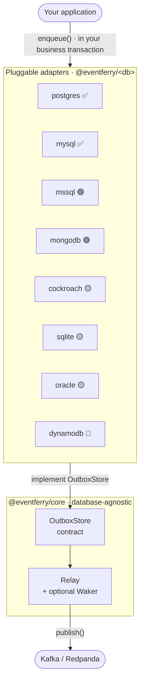
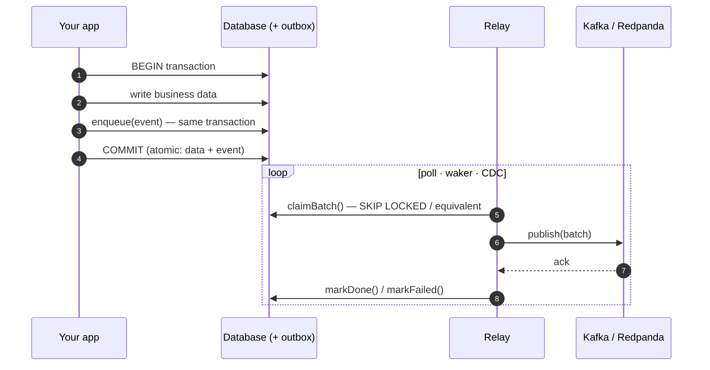
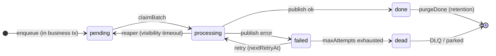
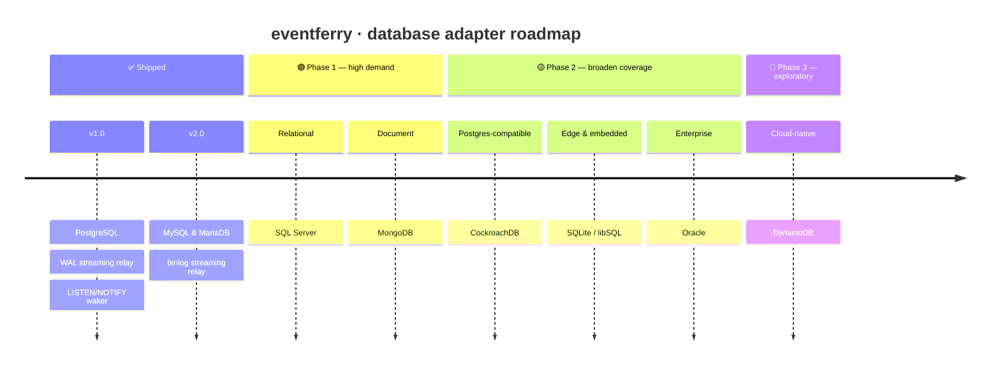
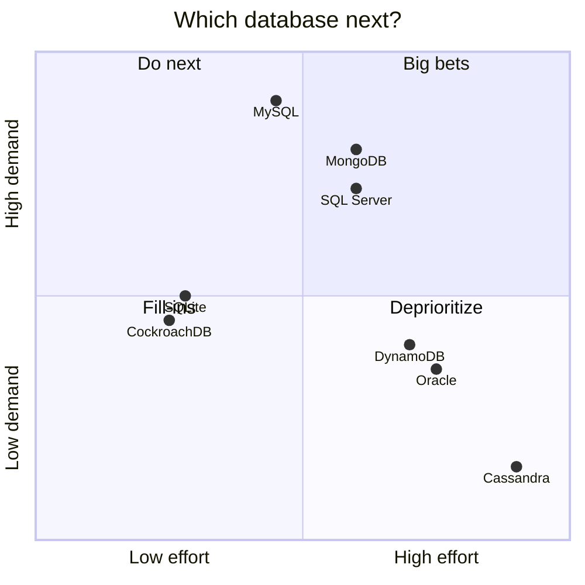
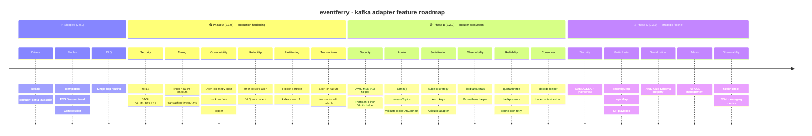

# 🛳️ eventferry Roadmap

**Where the project is going, by adapter.**

`✅ shipped` · `🟢 Phase 1` · `🟡 Phase 2` · `🔬 exploratory` · `⛔ not recommended`

This roadmap is organised in two parts:

- **[Part 1 — Database adapter support](#part-1--database-adapter-support)** —
  bringing the transactional-outbox guarantees to every database teams actually
  run. Each new database is a new `@eventferry/<db>` package.
- **[Part 2 — Kafka adapter capabilities](#part-2--kafka-adapter-capabilities)** —
  deepening `@eventferry/kafka` so it covers the production surface of the
  Kafka protocol that real shops need (security modes, producer tuning,
  observability, admin, EOS hardening).

---

# Part 1 — Database adapter support

eventferry today ships production-grade
[PostgreSQL](https://www.npmjs.com/package/@eventferry/postgres) and
[MySQL / MariaDB](https://www.npmjs.com/package/@eventferry/mysql) stores. The
relay in [`@eventferry/core`](https://www.npmjs.com/package/@eventferry/core)
never talks to a database directly — it talks to a small contract. So **every
new database is just a new adapter**, and this part of the roadmap is the plan
for shipping them.

---

## How the pieces fit

---

## The pattern, step by step

The whole point: the event and the business data commit **together or not at
all**, so there is no window where one exists without the other.

---

## What every adapter implements

This state machine is the contract. An adapter is "done" when it honors every
transition above. Concretely, each `@eventferry/<db>` package mirrors
`@eventferry/postgres`:

| Surface | Required? | Postgres reference |
|---|:--:|---|
| Transactional `enqueue` (same tx as the business write) | **Required** | `store.ts` |
| Concurrency-safe `claimBatch` (no double-claim across N relays) | **Required** | `store.ts` |
| `markDone` / `markFailed` (retry + DLQ lifecycle) | **Required** | `store.ts` |
| Crash-recovery reaper (visibility timeout) | **Required** | `store.ts` |
| Schema / index / trigger DDL generators | **Required** | `migrations.ts` |
| `purgeDone` retention of published rows | **Required** | `store.ts` |
| Low-latency wake source (`Waker`) | Optional | `notify-waker.ts` |
| CDC / log-tailing streaming relay | Optional | `streaming-relay.ts` |

Anything not natively supported degrades gracefully: **polling is always the
safety net**, the `Waker` only makes it faster, and the CDC relay is an opt-in
high-throughput alternative.

---

## Release timeline

## Prioritization — demand vs. effort

---

## Capability matrix

| Database | Package | Tx enqueue | Skip-locked claim | Native waker | CDC streaming | Driver |
|---|---|:--:|:--:|:--:|:--:|---|
| **PostgreSQL** | `@eventferry/postgres` ✅ shipped | ✅ | `FOR UPDATE SKIP LOCKED` | `LISTEN/NOTIFY` | logical replication (WAL / pgoutput) | `pg` |
| **MySQL / MariaDB** | `@eventferry/mysql` ✅ shipped | ✅ (InnoDB) | ✅ MySQL 8.0.1+ / MariaDB 10.6+ | ❌ → polling | binlog (planned) | `mysql2` |
| **SQL Server** | `@eventferry/mssql` | ✅ | `READPAST + UPDLOCK + ROWLOCK` | Query Notifications / Service Broker | native CDC / Change Tracking | `mssql` |
| **MongoDB** | `@eventferry/mongodb` | ✅ (replica set 4.0+) | atomic `findOneAndUpdate` + claim token | **Change Streams** | **Change Streams** (oplog) | `mongodb` |
| **CockroachDB** | `@eventferry/cockroach` | ✅ | `FOR UPDATE` (SKIP LOCKED 22.2+) | ❌ → polling | `CHANGEFEED` | `pg` |
| **SQLite / libSQL** | `@eventferry/sqlite` | ✅ | single-writer (no skip-locked) ⚠️ | ❌ | WAL tail ⚠️ | `better-sqlite3` / `@libsql/client` |
| **Oracle** | `@eventferry/oracle` | ✅ | `FOR UPDATE SKIP LOCKED` | CQN / AQ | LogMiner / GoldenGate | `oracledb` |
| **DynamoDB** | `@eventferry/dynamodb` | ✅ `TransactWriteItems` | conditional update | DynamoDB Streams | DynamoDB Streams | `@aws-sdk/client-dynamodb` |

---

## Phase 1 — high demand, strong fit 🟢

The three databases that cover the bulk of "we don't run Postgres" requests, each
with a clean answer for all three pillars.

### MySQL / MariaDB — `@eventferry/mysql` ✅ shipped
- [x] `claimBatch` via `SELECT ... FOR UPDATE SKIP LOCKED` (MySQL **8.0.1+**, MariaDB **10.6+**)
- [x] Polling-only by default (MySQL has no `LISTEN/NOTIFY`)
- [x] Binlog (row-based) streaming relay — `MysqlBinlogRelay` via `@vlasky/zongji`
- [x] Documented fallback for older engines: `UPDATE ... ORDER BY id LIMIT n` + claim-token pattern with a one-time `claim_token` column. Covered in the package README's "Running on an older engine" section with the full claim path + caveats (throughput vs engine-floor trade-off).
- [x] Passes the shared conformance kit on MySQL 8 **and** MariaDB 10.11 — integration suite parametrizes the `mysql-store` tests with `describe.each` against both engines. Caught a real MariaDB JSON-as-LONGTEXT driver-parity bug during the rollout (`row.ts` now defensively parses string payloads).

### SQL Server — `@eventferry/mssql`
- [ ] `claimBatch` via `UPDATE TOP (n) ... WITH (READPAST, UPDLOCK, ROWLOCK) ... OUTPUT inserted.*` (atomic claim-and-read)
- [ ] `Waker` via Query Notifications / Service Broker (`SqlDependency`)
- [ ] *(optional)* streaming relay over native CDC / Change Tracking
- [ ] Passes the conformance kit

### MongoDB — `@eventferry/mongodb`
- [ ] Transactional `enqueue` using a session (requires a **replica set**; sharded 4.2+)
- [ ] `claimBatch` via atomic `findOneAndUpdate` (`pending → processing`) with claim token + `claimedAt` reaper
- [ ] `Waker` **and** streaming relay from **Change Streams** (one mechanism, both jobs)
- [ ] Per-`aggregateId` ordering preserved
- [ ] Passes the conformance kit

---

## Phase 2 — broaden SQL & edge coverage 🟡

### CockroachDB — `@eventferry/cockroach`
- [ ] Validate `@eventferry/postgres` against CockroachDB (it is Postgres wire-compatible)
- [ ] Document caveats: `SKIP LOCKED` needs 22.2+, no `LISTEN/NOTIFY`
- [ ] `CHANGEFEED`-based streaming relay
- [ ] Same effort covers Yugabyte / Neon / Timescale / Citus

### SQLite / libSQL — `@eventferry/sqlite`
- [ ] Store on `better-sqlite3` / `@libsql/client` (local, embedded, edge — Turso)
- [ ] Single-relay, polling-only model — clearly documented constraints
- [ ] Makes examples and the conformance kit runnable with **zero infra**

### Oracle — `@eventferry/oracle`
- [ ] `claimBatch` via `FOR UPDATE SKIP LOCKED` (natively supported)
- [ ] `Waker` via Continuous Query Notification (CQN) or Advanced Queuing (AQ)
- [ ] *(optional)* streaming relay via LogMiner / GoldenGate
- [ ] Prioritized by demand (enterprise)

---

## Phase 3 — exploratory 🔬

### DynamoDB — `@eventferry/dynamodb`
- [ ] Transactional enqueue via `TransactWriteItems` (outbox item atomic with the business item)
- [ ] Claim via conditional updates
- [ ] CDC via **DynamoDB Streams** (→ Lambda / Kinesis)
- [ ] AWS-specific; depends on demand

### Not recommended ⛔
- **Cassandra / ScyllaDB** — no multi-partition ACID (lightweight transactions
  only), so the dual-write guarantee cannot be honored cleanly. Revisit only with
  a narrowly-scoped single-partition design.

---

## Cross-cutting: a shared conformance kit

Before adding adapters, extract a database-agnostic **conformance test suite**
(driven from `@eventferry/integration`) that every `@eventferry/<db>` package must pass:

- [ ] transactional enqueue is atomic with the business write (rollback drops the event)
- [ ] `claimBatch` never double-claims under N concurrent relays
- [ ] strict per-aggregate ordering holds
- [ ] the reaper reclaims rows stuck in `processing` past the visibility timeout
- [ ] retry/backoff → `dead` / DLQ lifecycle is honored
- [ ] `purgeDone` retention removes only published rows

This guarantees **identical behavior across databases** and turns "add a database"
into "implement the store + make the kit green."

---

## Out of scope for Part 1

Publisher / broker expansion (NATS, RabbitMQ, AWS SQS/SNS, Google Pub/Sub) and
serializer additions are tracked separately. Kafka-specific feature work lives in
[Part 2](#part-2--kafka-adapter-capabilities) below.

## Contributing a database adapter

Want a database that isn't here yet? Open an issue describing your engine and
version, or start an adapter using `@eventferry/postgres` as the reference
implementation →
[github.com/SametGoktepe/eventferry/issues](https://github.com/SametGoktepe/eventferry/issues).

---

# Part 2 — Kafka adapter capabilities

`@eventferry/kafka@2.0.0` ships a working transactional-outbox publisher with
both [`kafkajs`](https://kafka.js.org/) and
[`@confluentinc/kafka-javascript`](https://github.com/confluentinc/confluent-kafka-javascript)
drivers, idempotent + transactional producer, basic SASL, compression, and DLQ
routing. That's the **floor**. The Kafka protocol surface is large, and real
production deployments need more — TLS modes for managed clouds, latency/throughput
tuning knobs, observability hooks, error classification, admin operations.

This part of the roadmap turns the gap-analysis findings into milestones.

> Internal context: each item maps to a domain file under `docs/kafka-gap-analysis/`
> (gitignored — internal planning). The roadmap exposes the public-facing plan;
> the gap docs contain implementation notes, acceptance criteria, and rationale.

## Capability matrix — today

| Surface | `@eventferry/kafka@2.0.0` |
|---|---|
| Drivers | `kafkajs` + `@confluentinc/kafka-javascript`, custom-driver injection |
| Auth | SASL PLAIN / SCRAM-SHA-256 / SCRAM-SHA-512, `ssl: boolean` only |
| Producer modes | Idempotent (default on), Transactional (EOS), `acks` |
| Compression | `none` / `gzip` / `snappy` / `lz4` / `zstd` |
| Delivery | `sendBatch`, per-message `PublishResult { ok, error }` |
| DLQ | Single-hop routing, basic headers (`dlq-reason`, `dlq-original-topic`, `dlq-failed-at`) |
| Observability | Relay hooks (`onPublished`, `onFailed`, `onDead`), W3C trace header pass-through |
| Admin | _(not shipped)_ |

## Release timeline — Kafka adapter

## Phase A — 2.1.0 · production hardening 🟢

The "Tier 1 must-ship" items from the gap analysis. Each item is small enough to
be a single PR; all are **additive** to the public API (no breaking changes).

### Security · [details](./docs/kafka-gap-analysis/security.md)
- [ ] **mTLS** — replace `ssl: boolean` with `ssl: boolean | TlsConfig`. `TlsConfig` carries `ca`, `cert`, `key`, `passphrase`, `servername`. Maps to `tls.ConnectionOptions` for kafkajs (Buffer + PEM string both supported); for confluent driver we route Buffer→string and use librdkafka's `ssl.ca.pem` / `ssl.certificate.pem` / `ssl.key.pem` keys (file paths also supported via the `.location` variants). Verified against Redpanda integration test.
- [ ] **SASL OAUTHBEARER** — add `{ mechanism: "oauthbearer"; oauthBearerProvider: () => Promise<{ value, lifetime?, principal?, extensions? }> }`. Unlocks Azure Event Hubs and any OIDC-fronted cluster. **Driver asymmetry**: kafkajs reads only `value`; confluent **requires** `value + principal + lifetime` and accepts `extensions` — document that cross-driver providers must populate all four to be portable.

### Producer tuning · [details](./docs/kafka-gap-analysis/producer-tuning.md)
- [ ] **Both drivers** — `transactionTimeoutMs`, `requestTimeoutMs`, `maxInFlightRequests` (≤5 when idempotent).
- [ ] **librdkafka-only** (confluent driver) — `lingerMs`, `batchSize`, `deliveryTimeoutMs`, `maxRequestSize`. kafkajs has no equivalent producer knobs for these (its batching is sticky-partitioner + hardcoded internals). Public API accepts them; on kafkajs they log a one-time warn and are otherwise ignored. Document the driver-choice matrix in README: choose confluent when you need fine-grained tuning.
- [ ] **Coherence check at construction** — warn when `deliveryTimeoutMs > relayClaimTimeoutMs` (reaper double-publish risk).

### Observability · [details](./docs/kafka-gap-analysis/observability.md)
- [ ] **OpenTelemetry publish span** — one span per `sendBatch`, named `"{topic} publish"`, `SpanKind.PRODUCER`. Required attrs: `messaging.system=kafka`, `messaging.operation.type=publish`, `messaging.destination.name=<topic>`. Recommended: `messaging.batch.message_count`, `messaging.kafka.partition`, `server.address`/`server.port`. Single span per batch — never per-message (cardinality explosion). Adapter pattern — no OTel dep on us.
- [ ] **Hook surface** — `onConnect`, `onDisconnect`, `onPublish`, `onError`, `onTransactionAbort` on `KafkaPublisher`.
- [ ] **Logger passthrough** — accept core's `Logger`; no stray `console.log`.

### Reliability · [details](./docs/kafka-gap-analysis/reliability.md)
- [ ] **Error classification** — `PublishResult.errorKind: "retriable" | "fatal" | "poison" | "backpressure" | "quota"`. Core relay reads it for smart retry / DLQ / pause decisions. Starter mapping table for ~20 native error codes per driver is captured in `docs/kafka-gap-analysis/reliability.md`.
- [ ] **DLQ enrichment** — `dlq-attempts`, `dlq-error-class`, `dlq-original-aggregate-id`, `dlq-original-message-id`, optional truncated `dlq-error-stack`.
- [ ] **Backpressure surface** — queue-full returns `errorKind: "backpressure"` (librdkafka `ERR__QUEUE_FULL` = -184) instead of bubbling as a generic Error; relay PAUSES instead of burning attempts. Quota-throttle (`ERR_THROTTLING_QUOTA_EXCEEDED` = 89) maps to `errorKind: "quota"` — back off exponentially.

### Partitioning · [details](./docs/kafka-gap-analysis/partitioning.md)
- [ ] **Explicit per-message partition** — `PublishableMessage.partition?: number` override; drivers honor it.
- [ ] **kafkajs partitioner choice** — `partitioner?: "default" | "legacy" | "java-compatible"` to silence the `KafkaJSPartitionerNotSpecified` warning every greenfield user hits.

### Transactions · [details](./docs/kafka-gap-analysis/transactions-eos.md)
- [ ] **Abort on send failure inside a tx** — wrap `sendBatch` so a mid-batch throw calls `abortTransaction()` before propagating, preventing pending broker-side transactions until timeout.
- [ ] **`transactionalId` as a callable** — `() => string | Promise<string>` resolved at connect time, with documented derivation guidance for multi-instance fencing.

## Phase B — 2.2.0 · broader ecosystem 🟡

The "Tier 2 should-ship" set. Bigger surface or behind Phase A.

### Security
- [ ] **AWS MSK IAM helper** — separate `@eventferry/kafka-iam` package wrapping the Phase-A `oauthBearerProvider` with the AWS SigV4 signer; keeps the core package AWS-free.
- [ ] **Confluent Cloud OAuth helper** — companion doc + provider snippet for SSO-fronted Confluent accounts.

### Producer tuning
- [ ] **`rawProducerConfig?: Record<string, unknown>`** — typed escape hatch passed through to the active driver. Documented as outside SemVer guarantees.
- [ ] **`connectionsMaxIdleMs` / `metadataMaxAgeMs`** + **compression level** (per codec, where supported).

### Admin · [details](./docs/kafka-gap-analysis/admin-operations.md)
- [ ] **`publisher.admin(): KafkaAdmin`** — typed subset (`listTopics`, `describeTopics`, `createTopics`, `createPartitions`, `describeConfigs`, `alterConfigs`, `describeAcls`).
- [ ] **`ensureTopics([{ topic, numPartitions, replicationFactor, config }])`** — idempotent topic provisioning helper.
- [ ] **`validateTopicsOnConnect: boolean`** — fail-fast when configured topics are missing AND the cluster has `auto.create.topics.enable=false`.

### Serialization · [details](./docs/kafka-gap-analysis/serialization-schemas.md)
- [ ] **Subject naming strategy** — `subjectStrategy: "topic" | "record" | "topic_record"` on `SchemaRegistrySerializer`.
- [ ] **Schema Registry auth surface** — typed basic / bearer config.
- [ ] **Avro key serialization** — optional `Serializer.serializeKey?(record)`.
- [ ] **Auto-register policy toggle** — `autoRegister: boolean` with the production recommendation documented.
- [ ] **Apicurio Registry adapter** — `@eventferry/schema-registry-apicurio` shipping the same `Serializer` interface against Apicurio's REST API.

### Observability
- [ ] **librdkafka stats hook** — `onStatistics?(stats)` exposing the rich JSON metric stream from the confluent driver.
- [ ] **Prometheus helper** — optional `@eventferry/kafka/metrics` subpath import wiring hooks to `prom-client`.

### Reliability
- [ ] **Quota throttle surface** — `errorKind: "quota"` with a longer backoff suggestion.
- [ ] **Connection retry policy** — `connectionRetry: { initialBackoffMs, maxBackoffMs, maxAttempts }`.
- [ ] **Poison-pill detection** — encode failures map to `errorKind: "poison"`; skip retries; route straight to DLQ.

### Partitioning
- [ ] **Custom partitioner support** — `customPartitioner?: (message, partitionCount) => number`.

### Consumer-side · [details](./docs/kafka-gap-analysis/consumer-side.md)
- [ ] **`decode` helper** — sub-path import (`@eventferry/kafka/consume`) for round-tripping produced events with metadata + trace context.
- [ ] **Documented consume recipes** — README section + `defineOutbox` symmetric `events.decode(message)` companion.

## Phase C — 2.3.0 · strategic / niche 🔬

Tier 3 items. Worth knowing about; not blocking adoption.

### Security
- [ ] **SASL/GSSAPI (Kerberos)** — confluent driver only (kafkajs has no native support).

### Multi-cluster · [details](./docs/kafka-gap-analysis/multi-cluster.md)
- [ ] **`reconfigure(opts)`** — in-place bootstrap swap preserving hooks/serializer.
- [ ] **`topicMap?: (topic) => topic`** — for MirrorMaker-prefixed topics during failover.
- [ ] **DR playbook** as a sibling `docs/dr-pattern.md` document.

### Serialization
- [ ] **AWS Glue Schema Registry** — `@eventferry/schema-registry-aws` (different wire format from Confluent's).

### Admin
- [ ] **Full ACL management surface** — `createAcls`, `deleteAcls` beyond the Phase-B `describeAcls`.

### Observability
- [ ] **Health-check helper** — `publisher.healthCheck()` doing a no-op metadata refresh.
- [ ] **OpenTelemetry messaging metrics** — once OTel semantic conventions for these stabilize.

### Transactions
- [ ] **Producer-fenced restart auto-handling** — automatic `initTransactions` on reconnect with epoch fencing.

## Cross-cutting — Kafka adapter

These principles apply across every Phase A/B/C item.

1. **Driver parity.** Public API stays driver-agnostic. Each new option maps
   internally to both `kafkajs` and `confluent` driver shapes. If a feature
   exists only on one driver (e.g. Kerberos on librdkafka), document it as
   such and refuse cleanly on the other driver.
2. **Additive change, minor bumps.** Phase A and B items are designed to ship
   in minor versions (2.1.0, 2.2.0). Phase C items that would change defaults
   are deferred to a major; everything else stays additive.
3. **Escape hatch first.** When a user needs something we haven't typed yet,
   `rawProducerConfig` and the `customDriver` injection are the supported
   escape hatches. Document them; bias toward keeping the typed surface small
   and well-shaped.
4. **Testing.** Each option needs a unit test (fake driver records the option
   was passed) plus, where it changes broker-observable behavior, an integration
   test against the existing Redpanda Testcontainer.
5. **Documentation.** Each shipped feature gets:
   - A line in `@eventferry/kafka/README.md`
   - An entry in the root README capability table
   - A checked-off box in this roadmap

## Out of scope for Part 2

- Kafka Streams runtime (use the upstream project)
- Kafka Connect runtime (use the upstream project)
- ksqlDB integration
- Consumer-group framework (we publish; `decode` is the only consumer-side
  helper we ship)
- JMX bridge (Node ecosystem; Prometheus is the answer for us)

## Contributing a Kafka feature

Pick any unchecked `[ ]` from Phase A or B. Each item has acceptance criteria
in the matching `docs/kafka-gap-analysis/<domain>.md` file (internal, gitignored)
or can be inferred from the matrix above. Open an issue referencing this
roadmap and the domain file you're tackling →
[github.com/SametGoktepe/eventferry/issues](https://github.com/SametGoktepe/eventferry/issues).
