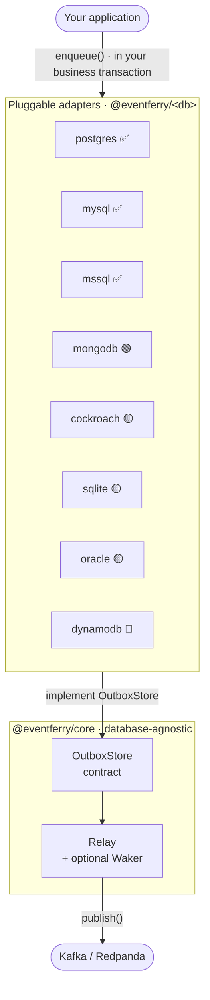
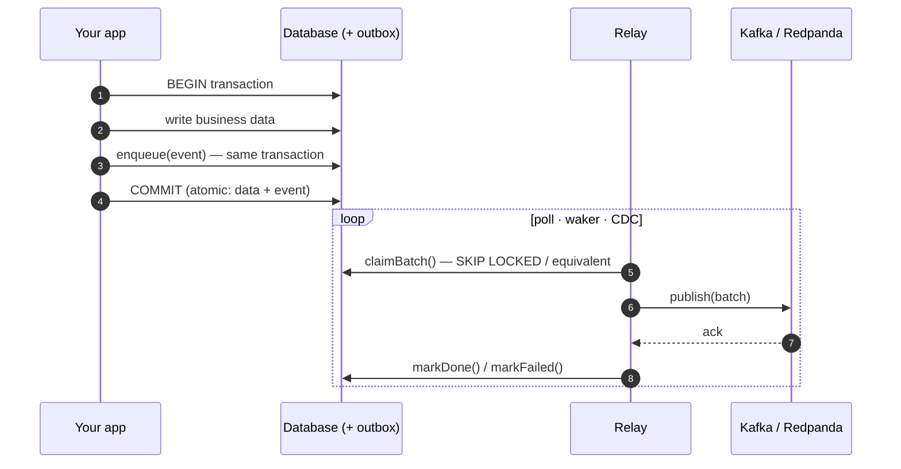
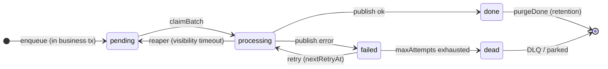
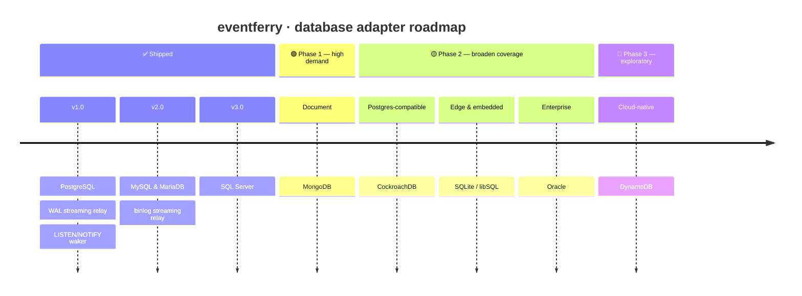
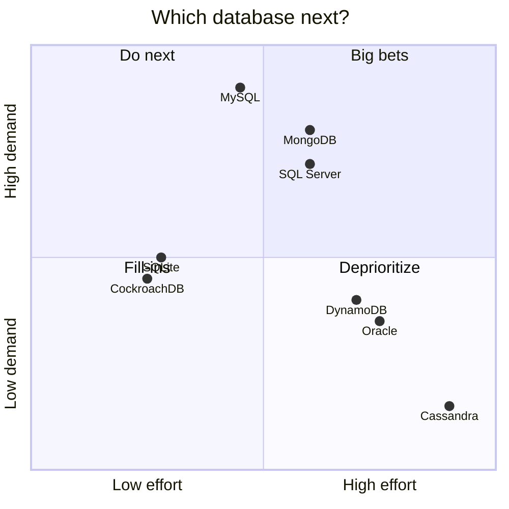

# 🛳️ eventferry Roadmap

**Where the project is going, by adapter.**

`✅ shipped` · `🟢 Phase 1` · `🟡 Phase 2` · `🔬 exploratory` · `⛔ not recommended`

This roadmap is organised in two parts:

- **[Part 1 — Database adapter support](#part-1--database-adapter-support)** —
  bringing the transactional-outbox guarantees to every database teams actually
  run. Each new database is a new `@eventferry/<db>` package.
- **[Part 2 — Kafka adapter capabilities](#part-2--kafka-adapter-capabilities)** —
  deepening `@eventferry/kafka` so it covers the production surface of the
  Kafka protocol that real shops need (security modes, producer tuning,
  observability, admin, EOS hardening).

---

# Part 1 — Database adapter support

eventferry today ships production-grade
[PostgreSQL](https://www.npmjs.com/package/@eventferry/postgres) and
[MySQL / MariaDB](https://www.npmjs.com/package/@eventferry/mysql) stores. The
relay in [`@eventferry/core`](https://www.npmjs.com/package/@eventferry/core)
never talks to a database directly — it talks to a small contract. So **every
new database is just a new adapter**, and this part of the roadmap is the plan
for shipping them.

---

## How the pieces fit

---

## The pattern, step by step

The whole point: the event and the business data commit **together or not at
all**, so there is no window where one exists without the other.

---

## What every adapter implements

This state machine is the contract. An adapter is "done" when it honors every
transition above. Concretely, each `@eventferry/<db>` package mirrors
`@eventferry/postgres`:

| Surface | Required? | Postgres reference |
|---|:--:|---|
| Transactional `enqueue` (same tx as the business write) | **Required** | `store.ts` |
| Concurrency-safe `claimBatch` (no double-claim across N relays) | **Required** | `store.ts` |
| `markDone` / `markFailed` (retry + DLQ lifecycle) | **Required** | `store.ts` |
| Crash-recovery reaper (visibility timeout) | **Required** | `store.ts` |
| Schema / index / trigger DDL generators | **Required** | `migrations.ts` |
| `purgeDone` retention of published rows | **Required** | `store.ts` |
| Low-latency wake source (`Waker`) | Optional | `notify-waker.ts` |
| CDC / log-tailing streaming relay | Optional | `streaming-relay.ts` |

Anything not natively supported degrades gracefully: **polling is always the
safety net**, the `Waker` only makes it faster, and the CDC relay is an opt-in
high-throughput alternative.

---

## Release timeline

## Prioritization — demand vs. effort

---

## Capability matrix

| Database | Package | Tx enqueue | Skip-locked claim | Native waker | CDC streaming | Driver |
|---|---|:--:|:--:|:--:|:--:|---|
| **PostgreSQL** | `@eventferry/postgres` ✅ shipped | ✅ | `FOR UPDATE SKIP LOCKED` | `LISTEN/NOTIFY` | logical replication (WAL / pgoutput) | `pg` |
| **MySQL / MariaDB** | `@eventferry/mysql` ✅ shipped | ✅ (InnoDB) | ✅ MySQL 8.0.1+ / MariaDB 10.6+ | ❌ → polling | binlog (planned) | `mysql2` |
| **SQL Server** | `@eventferry/mssql` ✅ shipped | ✅ | `READCOMMITTEDLOCK + READPAST + UPDLOCK + ROWLOCK` | ❌ → polling (v2 SSB) | CDC (separate v2 pkg) | `mssql` |
| **MongoDB** | `@eventferry/mongodb` | ✅ (replica set 4.0+) | atomic `findOneAndUpdate` + claim token | **Change Streams** | **Change Streams** (oplog) | `mongodb` |
| **CockroachDB** | `@eventferry/cockroach` | ✅ | `FOR UPDATE` (SKIP LOCKED 22.2+) | ❌ → polling | `CHANGEFEED` | `pg` |
| **SQLite / libSQL** | `@eventferry/sqlite` | ✅ | single-writer (no skip-locked) ⚠️ | ❌ | WAL tail ⚠️ | `better-sqlite3` / `@libsql/client` |
| **Oracle** | `@eventferry/oracle` | ✅ | `FOR UPDATE SKIP LOCKED` | CQN / AQ | LogMiner / GoldenGate | `oracledb` |
| **DynamoDB** | `@eventferry/dynamodb` | ✅ `TransactWriteItems` | conditional update | DynamoDB Streams | DynamoDB Streams | `@aws-sdk/client-dynamodb` |

---

## Phase 1 — high demand, strong fit 🟢

The three databases that cover the bulk of "we don't run Postgres" requests, each
with a clean answer for all three pillars.

### MySQL / MariaDB — `@eventferry/mysql` ✅ shipped
- [x] `claimBatch` via `SELECT ... FOR UPDATE SKIP LOCKED` (MySQL **8.0.1+**, MariaDB **10.6+**)
- [x] Polling-only by default (MySQL has no `LISTEN/NOTIFY`)
- [x] Binlog (row-based) streaming relay — `MysqlBinlogRelay` via `@vlasky/zongji`
- [x] Documented fallback for older engines: `UPDATE ... ORDER BY id LIMIT n` + claim-token pattern with a one-time `claim_token` column. Covered in the package README's "Running on an older engine" section with the full claim path + caveats (throughput vs engine-floor trade-off).
- [x] Passes the shared conformance kit on MySQL 8 **and** MariaDB 10.11 — integration suite parametrizes the `mysql-store` tests with `describe.each` against both engines. Caught a real MariaDB JSON-as-LONGTEXT driver-parity bug during the rollout (`row.ts` now defensively parses string payloads).

### SQL Server — `@eventferry/mssql` ✅ shipped
- [x] `claimBatch` via the canonical CTE + `UPDATE ... OUTPUT inserted.* INTO @claimed` pattern with `WITH (READCOMMITTEDLOCK, READPAST, UPDLOCK, ROWLOCK)` table hints. RCSI-safe (`READCOMMITTEDLOCK` forces locking semantics even when `READ_COMMITTED_SNAPSHOT` is ON on the database). Server-side reaper window via `DATEADD(MILLISECOND, -@claimTimeoutMs, SYSUTCDATETIME())`. Strict head-of-aggregate ordering enforced by `NOT EXISTS` on `(aggregate_id, id)`.
- [x] `createMigrationSql(table, { schema, useNativeJson })` — idempotent `IF OBJECT_ID(...)` guard, schema-qualified, three indexes (head-of-aggregate, filtered claim-ready, filtered done-retention). `useNativeJson` opt-in for SQL Server 2025+ / Azure SQL DB; default `NVARCHAR(MAX) CHECK (ISJSON(value) = 1)` for SQL Server 2016 SP1+ coverage.
- [x] Polling-only relay (the standard `@eventferry/core` `Relay` works against `MssqlStore` unchanged). Sub-second latency with the default `pollIntervalMs: 250`.
- [x] BIGINT id returned as JS string (tedious convention to avoid `Number.MAX_SAFE_INTEGER` precision loss). `payload` + `headers` always JSON.parse'd on read (`mssql` driver does not auto-parse, mirroring our MariaDB parity fix).
- [x] Passes the conformance kit on real SQL Server 2022 via Testcontainers — strict head-of-aggregate ordering, concurrent-claim no-duplicates, reaper window, requeue without attempts++, BIGINT-as-string, unicode payload round-trip, `markFailed(null, 'failed')` TypeError.
- [ ] `Waker` via Query Notifications / Service Broker — deferred to v2. Service Broker via `mssql`/`tedious` ties up a pool connection indefinitely (`WAITFOR (RECEIVE ...)`), and maintained Node libraries for SSB are abandoned. Polling-only in v1; documented v2 path.
- [ ] *(optional)* streaming relay over native CDC — deferred to a separate `@eventferry/mssql-cdc-relay` package. CDC requires SQL Server Agent (NOT available on Azure SQL Database — only Managed Instance and on-prem Windows).

### MongoDB — `@eventferry/mongodb`
- [ ] Transactional `enqueue` using a session (requires a **replica set**; sharded 4.2+)
- [ ] `claimBatch` via atomic `findOneAndUpdate` (`pending → processing`) with claim token + `claimedAt` reaper
- [ ] `Waker` **and** streaming relay from **Change Streams** (one mechanism, both jobs)
- [ ] Per-`aggregateId` ordering preserved
- [ ] Passes the conformance kit

---

## Phase 2 — broaden SQL & edge coverage 🟡

### CockroachDB — `@eventferry/cockroach`
- [ ] Validate `@eventferry/postgres` against CockroachDB (it is Postgres wire-compatible)
- [ ] Document caveats: `SKIP LOCKED` needs 22.2+, no `LISTEN/NOTIFY`
- [ ] `CHANGEFEED`-based streaming relay
- [ ] Same effort covers Yugabyte / Neon / Timescale / Citus

### SQLite / libSQL — `@eventferry/sqlite`
- [ ] Store on `better-sqlite3` / `@libsql/client` (local, embedded, edge — Turso)
- [ ] Single-relay, polling-only model — clearly documented constraints
- [ ] Makes examples and the conformance kit runnable with **zero infra**

### Oracle — `@eventferry/oracle`
- [ ] `claimBatch` via `FOR UPDATE SKIP LOCKED` (natively supported)
- [ ] `Waker` via Continuous Query Notification (CQN) or Advanced Queuing (AQ)
- [ ] *(optional)* streaming relay via LogMiner / GoldenGate
- [ ] Prioritized by demand (enterprise)

---

## Phase 3 — exploratory 🔬

### DynamoDB — `@eventferry/dynamodb`
- [ ] Transactional enqueue via `TransactWriteItems` (outbox item atomic with the business item)
- [ ] Claim via conditional updates
- [ ] CDC via **DynamoDB Streams** (→ Lambda / Kinesis)
- [ ] AWS-specific; depends on demand

### Not recommended ⛔
- **Cassandra / ScyllaDB** — no multi-partition ACID (lightweight transactions
  only), so the dual-write guarantee cannot be honored cleanly. Revisit only with
  a narrowly-scoped single-partition design.

---

## Cross-cutting: a shared conformance kit

Before adding adapters, extract a database-agnostic **conformance test suite**
(driven from `@eventferry/integration`) that every `@eventferry/<db>` package must pass:

- [ ] transactional enqueue is atomic with the business write (rollback drops the event)
- [ ] `claimBatch` never double-claims under N concurrent relays
- [ ] strict per-aggregate ordering holds
- [ ] the reaper reclaims rows stuck in `processing` past the visibility timeout
- [ ] retry/backoff → `dead` / DLQ lifecycle is honored
- [ ] `purgeDone` retention removes only published rows

This guarantees **identical behavior across databases** and turns "add a database"
into "implement the store + make the kit green."

---

## Out of scope for Part 1

Publisher / broker expansion (NATS, RabbitMQ, AWS SQS/SNS, Google Pub/Sub) and
serializer additions are tracked separately. Kafka-specific feature work lives in
[Part 2](#part-2--kafka-adapter-capabilities) below.

## Contributing a database adapter

Want a database that isn't here yet? Open an issue describing your engine and
version, or start an adapter using `@eventferry/postgres` as the reference
implementation →
[github.com/SametGoktepe/eventferry/issues](https://github.com/SametGoktepe/eventferry/issues).

---

# Part 2 — Kafka adapter capabilities

`@eventferry/kafka@2.0.0` ships a working transactional-outbox publisher with
both [`kafkajs`](https://kafka.js.org/) and
[`@confluentinc/kafka-javascript`](https://github.com/confluentinc/confluent-kafka-javascript)
drivers, idempotent + transactional producer, basic SASL, compression, and DLQ
routing. That's the **floor**. The Kafka protocol surface is large, and real
production deployments need more — TLS modes for managed clouds, latency/throughput
tuning knobs, observability hooks, error classification, admin operations.

This part of the roadmap turns the gap-analysis findings into milestones.

> Internal context: each item maps to a domain file under `docs/kafka-gap-analysis/`
> (gitignored — internal planning). The roadmap exposes the public-facing plan;
> the gap docs contain implementation notes, acceptance criteria, and rationale.

## Capability matrix — today

| Surface | `@eventferry/kafka@3.5.0` |
|---|---|
| Drivers | `kafkajs` + `@confluentinc/kafka-javascript`, custom-driver injection |
| Auth | SASL PLAIN / SCRAM-SHA-256 / SCRAM-SHA-512 / OAUTHBEARER, full `TlsConfig` (mTLS, CA pinning, SNI) |
| AWS MSK IAM | `@eventferry/kafka-iam` package — SigV4-signed OAUTHBEARER with refresh-ahead caching |
| Producer modes | Idempotent (default on), Transactional (EOS) with callable `transactionalId`, `acks` |
| Compression | `none` / `gzip` / `snappy` / `lz4` / `zstd` + `compressionLevel` (confluent) |
| Tuning | `lingerMs`, `batchSize`, `requestTimeoutMs`, `deliveryTimeoutMs`, `maxRequestSize`, `maxInFlightRequests`, `transactionTimeoutMs` |
| Power-user | `rawProducerConfig` (librdkafka), `rawKafkaJsProducerConfig` (kafkajs), `customPartitioner` (kafkajs) |
| Delivery | `sendBatch`, per-message `PublishResult { ok, error, errorKind }` |
| Error classification | `retriable` / `fatal` / `poison` / `backpressure` / `quota` / `fenced` |
| DLQ | Configurable suffix / topic function, enriched headers (`dlq-reason`, `dlq-error-class`, `dlq-original-topic`, `dlq-failed-at`, `dlq-attempts`, optional `dlq-stack`) |
| Observability | Publisher + relay hooks, OTel span per batch + W3C `inject`, structured Logger plumbing, librdkafka `onStats` |
| Admin | `publisher.admin()`, `ensureTopics(specs, { growPartitions })`, `validateTopicsOnConnect` |
| Health | `publisher.healthCheck({ timeoutMs })` returning `HealthStatus` |
| Fence recovery | `errorKind: "fenced"` taxonomy + `onProducerFenced` hook + optional `autoRecoverFromFence` |
| Consumer subpath | `@eventferry/kafka/consume` — `decode(message, { decoder })` + `extractTraceContext(headers)` |
| Schema Registry | Avro / Protobuf / JSON Schema, three subject strategies, basic + bearer auth, `serializeKey`, `autoRegister` toggle |

## Release timeline — Kafka adapter

```mermaid
timeline
    title eventferry · kafka adapter feature roadmap
    section ✅ Phase A — production hardening
        Security : mTLS : SASL OAUTHBEARER
        Tuning : linger / batch / timeouts : transaction.timeout.ms
        Observability : OpenTelemetry span : hook surface : logger
        Reliability : error classification : DLQ enrichment : backpressure : quota multiplier
        Partitioning : explicit partition : kafkajs warn fix
        Transactions : abort-on-failure : transactionalId callable
    section ✅ Phase B — broader ecosystem
        Security : AWS MSK IAM helper
        Admin : admin() : ensureTopics : validateTopicsOnConnect
        Serialization : subject strategy : Avro keys : autoRegister toggle
        Consumer : decode helper : trace-context extract : tracer.inject
        Tuning : compressionLevel : rawProducerConfig : customPartitioner
    section ✅ Phase C — production-grade observability + EOS hardening
        Observability : librdkafka stats hook : healthCheck()
        Reliability : producer-fenced restart + autoRecoverFromFence
        Serialization : Schema Registry auth (basic / bearer)
        Security : TLS CA + SNI docs
        Consumer : DLQ recipe : typed registry companion
    section 🟢 Phase D — planned
        Reliability : onMessageRetried hook : per-topic retry policy
        Serialization : compatibility-mode probe : reference schemas
        Observability : OTel messaging metrics : Prometheus helper
        Admin : describeAcls probe at startup
    section 🔬 Demand-gated
        Security : SASL/GSSAPI (Kerberos) : DELEGATION_TOKEN
        Serialization : Apicurio Registry : AWS Glue SR
        Multi-cluster : reconfigure() : topicMap : DR playbook
        Stores : MongoDB : DynamoDB
        Publishers : NATS : RabbitMQ : Pulsar
```

## Phase A — production hardening ✅ Shipped

The "Tier 1 must-ship" items from the gap analysis. All additive to the public API; no breaking changes.

### Security · [details](./docs/kafka-gap-analysis/security.md)
- [x] **mTLS** — `ssl: boolean | TlsConfig`. `TlsConfig` carries `ca`, `cert`, `key`, `passphrase`, `servername`. Maps to `tls.ConnectionOptions` for kafkajs (Buffer + PEM string both supported); for confluent driver we route Buffer→string and use librdkafka's `ssl.ca.pem` / `ssl.certificate.pem` / `ssl.key.pem` keys. Verified against Redpanda integration test.
- [x] **SASL OAUTHBEARER** — `{ mechanism: "oauthbearer"; oauthBearerProvider: () => Promise<{ value, lifetime?, principal?, extensions? }> }`. Unlocks Azure Event Hubs and any OIDC-fronted cluster. **Driver asymmetry**: kafkajs reads only `value`; confluent **requires** `value + principal + lifetime` and accepts `extensions` — documented in the JSDoc + wiki.

### Producer tuning · [details](./docs/kafka-gap-analysis/producer-tuning.md)
- [x] **Both drivers** — `transactionTimeoutMs`, `requestTimeoutMs`, `maxInFlightRequests` (≤5 when idempotent).
- [x] **librdkafka-only** (confluent driver) — `lingerMs`, `batchSize`, `deliveryTimeoutMs`, `maxRequestSize`. kafkajs has no equivalent producer knobs for these; public API accepts them and on kafkajs they log a one-time warn and are otherwise ignored. Documented in the kafka README under "Producer tuning".
- [ ] **Coherence check at construction** — warn when `deliveryTimeoutMs > relayClaimTimeoutMs` (reaper double-publish risk). Deferred to a follow-up — the relay's claim-timeout isn't visible at publisher construction without plumbing.

### Observability · [details](./docs/kafka-gap-analysis/observability.md)
- [x] **OpenTelemetry publish span** — one span per `sendBatch`, named `"{topic} publish"`, `SpanKind.PRODUCER`. Attrs: `messaging.system=kafka`, `messaging.operation.type=publish`, `messaging.destination.name=<topic>`, `messaging.batch.message_count`. Single span per batch — never per-message (cardinality explosion). Adapter pattern — no OTel dep on us.
- [x] **Hook surface** — `onConnect`, `onDisconnect`, `onPublish`, `onError`, `onTransactionAbort` on `KafkaPublisher`.
- [x] **Logger passthrough** — accepts core's `Logger`; no stray `console.log`.

### Reliability · [details](./docs/kafka-gap-analysis/reliability.md)
- [x] **Error classification** — `PublishResult.errorKind: "retriable" | "fatal" | "poison" | "backpressure" | "quota" | "fenced"`. Core relay reads it for smart retry / DLQ / pause decisions. Mapping tables in `kafkajs-classifier.ts` and `confluent-classifier.ts` cover ~40 native error codes per driver.
- [x] **DLQ enrichment** — `dlq-attempts`, `dlq-error-class`, `dlq-original-topic`, `dlq-failed-at`, optional truncated UTF-8 `dlq-stack`.
- [x] **Backpressure surface** — queue-full returns `errorKind: "backpressure"` (librdkafka `ERR__QUEUE_FULL` = -184); relay requeues without incrementing attempts.
- [x] **Quota multiplier** — `errorKind: "quota"` (`THROTTLING_QUOTA_EXCEEDED` = 89) maps to `RetryConfig.quotaMultiplier` × backoff (default 5×).

### Partitioning · [details](./docs/kafka-gap-analysis/partitioning.md)
- [x] **Explicit per-message partition** — `PublishableMessage.partition?: number` override; both drivers honor it.
- [x] **kafkajs partitioner choice** — `partitioner?: "default" | "legacy" | "java-compatible"` silences the `KafkaJSPartitionerNotSpecified` warning. Default `java-compatible` for non-transactional producers.

### Transactions · [details](./docs/kafka-gap-analysis/transactions-eos.md)
- [x] **Abort on send failure inside a tx** — `sendBatch` calls `abortTransaction()` before propagating a mid-batch throw, preventing pending broker-side transactions until timeout. `onTransactionAbort` hook fires for observability.
- [x] **`transactionalId` as a callable** — `() => string | Promise<string>` resolved at connect time, with multi-instance EOS guidance documented in the kafka README + wiki.

## Phase B — broader ecosystem ✅ Shipped

The "Tier 2 should-ship" set plus several Tier 3 items pulled forward when the surface fit cleanly.

### Security
- [x] **AWS MSK IAM helper** — separate `@eventferry/kafka-iam` package wrapping the Phase-A `oauthBearerProvider` with the AWS SigV4 signer. Process-local token cache with configurable refresh-ahead window (default 60s on the 15-min MSK lifetime), concurrent-refresh dedup, transient-failure recovery. Keeps the core package AWS-free.

### Producer tuning
- [x] **`rawProducerConfig`** (librdkafka) and **`rawKafkaJsProducerConfig`** (kafkajs) — typed escape hatches; native keys win against the translated config.
- [x] **`compressionLevel`** — librdkafka `compression.level` (zstd 1–22 etc.). Confluent only; kafkajs warns + ignores.
- [ ] **`connectionsMaxIdleMs` / `metadataMaxAgeMs`** — niche; reachable via `rawKafkaJsProducerConfig` today. Typed surface deferred.

### Admin · [details](./docs/kafka-gap-analysis/admin-operations.md)
- [x] **`publisher.admin(): KafkaAdmin`** — typed subset shipped: `listTopics`, `describeTopics`, `createTopics`, `createPartitions`. `alterConfigs` / `describeConfigs` / `describeAcls` deferred — reach for the raw driver admin until demand justifies typed wrappers.
- [x] **`ensureTopics(specs, { growPartitions })`** — idempotent topic provisioning helper. Replication factor + configEntries on EXISTING topics intentionally NOT reconciled (Kafka has no safe in-place alter).
- [x] **`validateTopicsOnConnect: string[]`** — fail-fast at startup listing every missing topic. Final shape takes a `string[]` rather than a boolean — explicit > magic introspection.

### Serialization · [details](./docs/kafka-gap-analysis/serialization-schemas.md)
- [x] **Subject naming strategy** — `subjectStrategy: "TopicNameStrategy" | "RecordNameStrategy" | "TopicRecordNameStrategy"` + `recordName` resolver + explicit `subject` function override. Legacy single-arg `subject` callable still works.
- [x] **Avro key serialization** — `keySchemas` option + `serializeKey(record)` method. Returns `null` for keyless records. NOT wired into the relay automatically — application-level convention.
- [x] **Auto-register policy toggle** — `autoRegister: boolean`. With `false`, always resolves via `getLatestSchemaId`; locally supplied schemas become docs-only.

### Consumer-side · [details](./docs/kafka-gap-analysis/consumer-side.md)
- [x] **`decode` helper** — `@eventferry/kafka/consume` subpath import returning `{ key, value, headers, timestamp, offset, partition }`. Built-in decoders: `json` (default), `utf8`, `none`, or a custom `(bytes) => V`. Tombstones come back as `null` for every decoder.
- [x] **`extractTraceContext(headers)`** — strict W3C `traceparent` / `tracestate` parse (rejects all-zero IDs, version `ff`, malformed hex). Accepts both raw (Buffer) and decoded (string) header shapes.
- [x] **`KafkaTracer.inject`** — optional publisher-side hook that writes the W3C trace context into outbound headers. Publisher CLONES each message before invoking inject — caller's `PublishableMessage` reference is never mutated.

### Partitioning
- [x] **Custom partitioner support** — `customPartitioner: () => (args) => number` factory on the kafkajs driver. Confluent ignores (librdkafka's partitioner is a C-level extension point, not a JS callback).

## Phase C — production-grade observability + EOS hardening ✅ Shipped

Closes the operational + EOS gaps identified after Phase B's broad-ecosystem rollout. Half-feature, half-doc round.

### Observability
- [x] **librdkafka stats hook** — `onStats: (stats: LibrdkafkaStats) => void` on the confluent driver. Wraps librdkafka's `stats_cb`, parses the JSON it emits, swallows callback exceptions + parse failures so a misbehaving observer cannot take down the producer loop. `statsIntervalMs` defaults to 30s when the hook is set, OFF otherwise (CPU-billed). kafkajs warns + ignores.
- [x] **`publisher.healthCheck({ timeoutMs })`** — cheap reachability probe usable as `/healthz` / `/readyz`. Borrows a fresh admin, calls `listTopics`, returns `{ ok, latencyMs, timestamp, error? }`. Default timeout 5_000 ms; `timeoutMs: 0` disables. Always closes the borrowed admin; swallows close errors. Custom drivers without admin return `{ ok: false, error }`. Documented as "broker reachable + auth good", explicitly NOT "publisher fully operational" — a fenced transactional producer would still answer healthy.

### Reliability
- [x] **Producer-fenced restart** — `PRODUCER_FENCED` and `INVALID_PRODUCER_EPOCH` split out of `"fatal"` into a new `errorKind: "fenced"`. Optional `autoRecoverFromFence: boolean` (default `false`) triggers one transparent `disconnect → connect → re-send` cycle on a fenced batch. Concurrent fenced publishes share a single in-flight reconnect. `onProducerFenced(error)` hook fires regardless of the recovery flag. Multi-instance EOS guidance: leave OFF, use a callable `transactionalId` derived from per-pod runtime context — cross-instance fence is the broker telling the loser to stop.

### Schema Registry
- [x] **Schema Registry auth surface** — typed `auth?: { type: "basic", username, password } | { type: "bearer", token: string | () => string | Promise<string> }`. Bearer wires a small middleware on the upstream client; callable tokens resolved per request, so rotation lives in the caller's provider. Ignored when an already-constructed `registry` client is injected.

### Security
- [x] **TLS CA + SNI documentation** — no API change. `TlsConfig.ca` / `.servername` were already on the surface; this round hardened the JSDoc (driver-parity gap: kafkajs honors `servername`, confluent no-ops it) and added README sections for "Dev cluster with a self-signed cert" + "IP-literal brokers (cert hostname mismatch)" with copy-paste examples. `rejectUnauthorized: false` deliberately stays out of the type — TLS verification is non-negotiable.

### Consumer-side
- [x] **DLQ consumer recipe + typed-event registry companion docs** — root README + kafka README gained `Consuming what eventferry produced` and `Consuming the DLQ` sections showing the canonical `decode → extractTraceContext → defineOutbox(registry).decode` loop and DLQ routing by `dlq-error-class` (rather than parsing `dlq-reason` text). Pure docs — no API change; `defineOutbox(registry).decode()` was already shipped.

### Adversarial integration sweep
- [x] **Postgres + MySQL bug hunt** — 26 integration tests covering concurrency (no double-claim under load, strict head-of-aggregate ordering), idempotency (markDone twice, empty list, non-existent id), requeue not incrementing attempts, claimBatch hygiene, 1 MB JSON / unicode / emoji / null payload survival, `markFailed` monotonicity, `'dead'` status fencing the reaper. 26/26 pass — no production bugs found.

## Phase D — planned 🟢

Targeted for upcoming releases. Each item is single-PR-sized unless flagged otherwise.

### Reliability
- [ ] **`onMessageRetried` hook** — fires per per-record retry attempt. Currently only `onFailed(record, err, willRetry)` fires once at failure; observability stacks want a per-retry counter.
- [ ] **Configurable per-topic retry policy** — `retry: { perTopic: { "orders.created": { maxAttempts: 10 } } }`. Today `retry` is global.
- [ ] **Coherence check at construction** — warn when `deliveryTimeoutMs > relayClaimTimeoutMs` (carried over from Phase A).

### Serialization
- [ ] **Compatibility-mode probe** — at `connect()`, verify each configured topic's compatibility mode against the registry and warn if `NONE`. Catches "no schema enforcement" misconfigurations early.
- [ ] **Reference schema support** — pass-through to upstream for Protobuf nested types; documented examples.

### Observability
- [ ] **OpenTelemetry messaging metrics** — separate from spans, the new OTel `messaging.client.published.messages` counter. Wait until OTel SDK stabilizes the API.
- [ ] **Prometheus metrics helper** — small optional package (`@eventferry/kafka-metrics`) registering standard signals as `prom-client` gauges + counters.

### Admin
- [ ] **`describeAcls` probe at startup** — optional. Verify the configured principal can `Write` on each known topic. Catches silent SASL auth that fails per-record.

## Demand-gated 🔬

We'll build these when someone needs them and is willing to pilot. Open an issue with your use case.

### Security
- [ ] **SASL/GSSAPI (Kerberos)** — enterprise on-prem only. librdkafka supports it natively, so the work is exposing the right config on the `confluent` driver.
- [ ] **DELEGATION_TOKEN** — niche, big-platform-only.

### Multi-cluster · [details](./docs/kafka-gap-analysis/multi-cluster.md)
- [ ] **`reconfigure(opts)`** — in-place bootstrap swap preserving hooks/serializer.
- [ ] **`topicMap?: (topic) => topic`** — for MirrorMaker-prefixed topics during failover.
- [ ] **DR playbook** as a sibling `docs/dr-pattern.md` document.

### Serialization
- [ ] **Apicurio Registry adapter** — separate package `@eventferry/schema-registry-apicurio` conforming to the same `Serializer` interface. Real demand from Red Hat shops.
- [ ] **AWS Glue Schema Registry** — `@eventferry/schema-registry-aws` (different wire format from Confluent's).

### Admin
- [ ] **Full ACL management surface** — `createAcls`, `deleteAcls`.

### Stores
- [ ] **MongoDB** — see [Part 1](#part-1--database-adapter-support).
- [ ] **DynamoDB** — see [Part 1](#part-1--database-adapter-support).

### Publishers
- [ ] **NATS / RabbitMQ / Pulsar** — outbox pattern works against any broker. Same `Publisher` interface shape; we'd ship NATS first based on community signal.

## Cross-cutting — Kafka adapter

These principles apply across every Phase A/B/C item.

1. **Driver parity.** Public API stays driver-agnostic. Each new option maps
   internally to both `kafkajs` and `confluent` driver shapes. If a feature
   exists only on one driver (e.g. Kerberos on librdkafka), document it as
   such and refuse cleanly on the other driver.
2. **Additive change, minor bumps.** Phase A and B items are designed to ship
   in minor versions (2.1.0, 2.2.0). Phase C items that would change defaults
   are deferred to a major; everything else stays additive.
3. **Escape hatch first.** When a user needs something we haven't typed yet,
   `rawProducerConfig` and the `customDriver` injection are the supported
   escape hatches. Document them; bias toward keeping the typed surface small
   and well-shaped.
4. **Testing.** Each option needs a unit test (fake driver records the option
   was passed) plus, where it changes broker-observable behavior, an integration
   test against the existing Redpanda Testcontainer.
5. **Documentation.** Each shipped feature gets:
   - A line in `@eventferry/kafka/README.md`
   - An entry in the root README capability table
   - A checked-off box in this roadmap

## Out of scope for Part 2

- Kafka Streams runtime (use the upstream project)
- Kafka Connect runtime (use the upstream project)
- ksqlDB integration
- Consumer-group framework (we publish; `decode` is the only consumer-side
  helper we ship)
- JMX bridge (Node ecosystem; Prometheus is the answer for us)

## Contributing a Kafka feature

Pick any unchecked `[ ]` from Phase A or B. Each item has acceptance criteria
in the matching `docs/kafka-gap-analysis/<domain>.md` file (internal, gitignored)
or can be inferred from the matrix above. Open an issue referencing this
roadmap and the domain file you're tackling →
[github.com/SametGoktepe/eventferry/issues](https://github.com/SametGoktepe/eventferry/issues).
