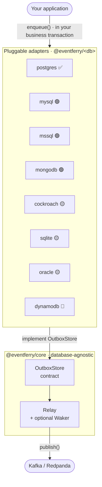
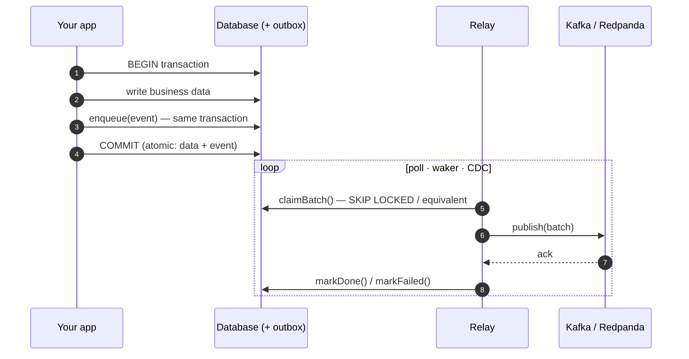
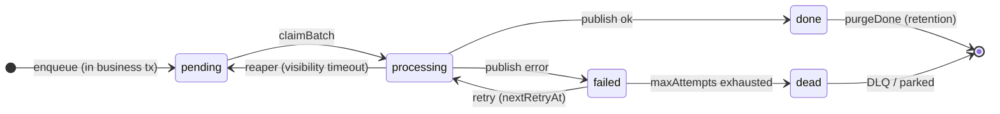
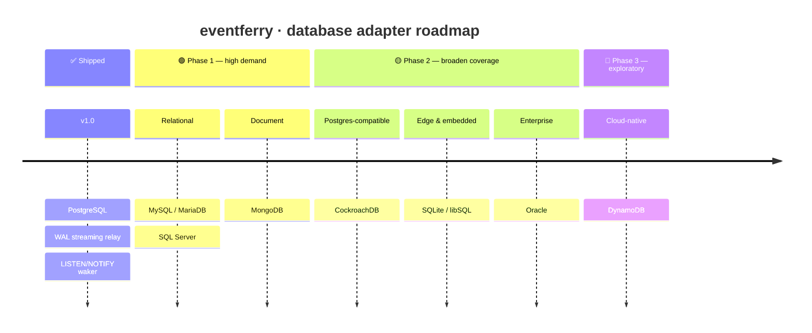
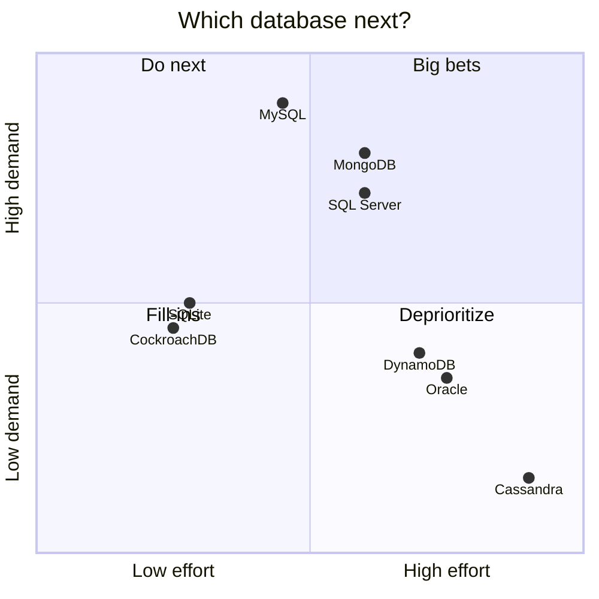

# 🛳️ eventferry Roadmap — Database Support

**Bringing the transactional-outbox guarantees to every database teams actually run.**

`✅ shipped` · `🟢 Phase 1` · `🟡 Phase 2` · `🔬 exploratory` · `⛔ not recommended`

eventferry today ships a production-grade
[PostgreSQL](https://www.npmjs.com/package/@eventferry/postgres) store. The relay
in [`@eventferry/core`](https://www.npmjs.com/package/@eventferry/core) never
talks to a database directly — it talks to a small contract. So **every new
database is just a new adapter**, and this roadmap is the plan for shipping them.

---

## How the pieces fit

---

## The pattern, step by step

The whole point: the event and the business data commit **together or not at
all**, so there is no window where one exists without the other.

---

## What every adapter implements

This state machine is the contract. An adapter is "done" when it honors every
transition above. Concretely, each `@eventferry/<db>` package mirrors
`@eventferry/postgres`:

| Surface | Required? | Postgres reference |
|---|:--:|---|
| Transactional `enqueue` (same tx as the business write) | **Required** | `store.ts` |
| Concurrency-safe `claimBatch` (no double-claim across N relays) | **Required** | `store.ts` |
| `markDone` / `markFailed` (retry + DLQ lifecycle) | **Required** | `store.ts` |
| Crash-recovery reaper (visibility timeout) | **Required** | `store.ts` |
| Schema / index / trigger DDL generators | **Required** | `migrations.ts` |
| `purgeDone` retention of published rows | **Required** | `store.ts` |
| Low-latency wake source (`Waker`) | Optional | `notify-waker.ts` |
| CDC / log-tailing streaming relay | Optional | `streaming-relay.ts` |

Anything not natively supported degrades gracefully: **polling is always the
safety net**, the `Waker` only makes it faster, and the CDC relay is an opt-in
high-throughput alternative.

---

## Release timeline

## Prioritization — demand vs. effort

---

## Capability matrix

| Database | Package | Tx enqueue | Skip-locked claim | Native waker | CDC streaming | Driver |
|---|---|:--:|:--:|:--:|:--:|---|
| **PostgreSQL** | `@eventferry/postgres` ✅ shipped | ✅ | `FOR UPDATE SKIP LOCKED` | `LISTEN/NOTIFY` | logical replication (WAL / pgoutput) | `pg` |
| **MySQL / MariaDB** | `@eventferry/mysql` ✅ shipped | ✅ (InnoDB) | ✅ MySQL 8.0.1+ / MariaDB 10.6+ | ❌ → polling | binlog (planned) | `mysql2` |
| **SQL Server** | `@eventferry/mssql` | ✅ | `READPAST + UPDLOCK + ROWLOCK` | Query Notifications / Service Broker | native CDC / Change Tracking | `mssql` |
| **MongoDB** | `@eventferry/mongodb` | ✅ (replica set 4.0+) | atomic `findOneAndUpdate` + claim token | **Change Streams** | **Change Streams** (oplog) | `mongodb` |
| **CockroachDB** | `@eventferry/cockroach` | ✅ | `FOR UPDATE` (SKIP LOCKED 22.2+) | ❌ → polling | `CHANGEFEED` | `pg` |
| **SQLite / libSQL** | `@eventferry/sqlite` | ✅ | single-writer (no skip-locked) ⚠️ | ❌ | WAL tail ⚠️ | `better-sqlite3` / `@libsql/client` |
| **Oracle** | `@eventferry/oracle` | ✅ | `FOR UPDATE SKIP LOCKED` | CQN / AQ | LogMiner / GoldenGate | `oracledb` |
| **DynamoDB** | `@eventferry/dynamodb` | ✅ `TransactWriteItems` | conditional update | DynamoDB Streams | DynamoDB Streams | `@aws-sdk/client-dynamodb` |

---

## Phase 1 — high demand, strong fit 🟢

The three databases that cover the bulk of "we don't run Postgres" requests, each
with a clean answer for all three pillars.

### MySQL / MariaDB — `@eventferry/mysql` ✅ shipped
- [x] `claimBatch` via `SELECT ... FOR UPDATE SKIP LOCKED` (MySQL **8.0.1+**, MariaDB **10.6+**)
- [x] Polling-only by default (MySQL has no `LISTEN/NOTIFY`)
- [x] Binlog (row-based) streaming relay — `MysqlBinlogRelay` via `@vlasky/zongji`
- [ ] Documented fallback for older engines: atomic status-flip with `UPDATE ... ORDER BY id LIMIT n` + claim token
- [ ] Passes the shared conformance kit on MySQL 8 **and** MariaDB (integration suite)

### SQL Server — `@eventferry/mssql`
- [ ] `claimBatch` via `UPDATE TOP (n) ... WITH (READPAST, UPDLOCK, ROWLOCK) ... OUTPUT inserted.*` (atomic claim-and-read)
- [ ] `Waker` via Query Notifications / Service Broker (`SqlDependency`)
- [ ] *(optional)* streaming relay over native CDC / Change Tracking
- [ ] Passes the conformance kit

### MongoDB — `@eventferry/mongodb`
- [ ] Transactional `enqueue` using a session (requires a **replica set**; sharded 4.2+)
- [ ] `claimBatch` via atomic `findOneAndUpdate` (`pending → processing`) with claim token + `claimedAt` reaper
- [ ] `Waker` **and** streaming relay from **Change Streams** (one mechanism, both jobs)
- [ ] Per-`aggregateId` ordering preserved
- [ ] Passes the conformance kit

---

## Phase 2 — broaden SQL & edge coverage 🟡

### CockroachDB — `@eventferry/cockroach`
- [ ] Validate `@eventferry/postgres` against CockroachDB (it is Postgres wire-compatible)
- [ ] Document caveats: `SKIP LOCKED` needs 22.2+, no `LISTEN/NOTIFY`
- [ ] `CHANGEFEED`-based streaming relay
- [ ] Same effort covers Yugabyte / Neon / Timescale / Citus

### SQLite / libSQL — `@eventferry/sqlite`
- [ ] Store on `better-sqlite3` / `@libsql/client` (local, embedded, edge — Turso)
- [ ] Single-relay, polling-only model — clearly documented constraints
- [ ] Makes examples and the conformance kit runnable with **zero infra**

### Oracle — `@eventferry/oracle`
- [ ] `claimBatch` via `FOR UPDATE SKIP LOCKED` (natively supported)
- [ ] `Waker` via Continuous Query Notification (CQN) or Advanced Queuing (AQ)
- [ ] *(optional)* streaming relay via LogMiner / GoldenGate
- [ ] Prioritized by demand (enterprise)

---

## Phase 3 — exploratory 🔬

### DynamoDB — `@eventferry/dynamodb`
- [ ] Transactional enqueue via `TransactWriteItems` (outbox item atomic with the business item)
- [ ] Claim via conditional updates
- [ ] CDC via **DynamoDB Streams** (→ Lambda / Kinesis)
- [ ] AWS-specific; depends on demand

### Not recommended ⛔
- **Cassandra / ScyllaDB** — no multi-partition ACID (lightweight transactions
  only), so the dual-write guarantee cannot be honored cleanly. Revisit only with
  a narrowly-scoped single-partition design.

---

## Cross-cutting: a shared conformance kit

Before adding adapters, extract a database-agnostic **conformance test suite**
(driven from `@eventferry/integration`) that every `@eventferry/<db>` package must pass:

- [ ] transactional enqueue is atomic with the business write (rollback drops the event)
- [ ] `claimBatch` never double-claims under N concurrent relays
- [ ] strict per-aggregate ordering holds
- [ ] the reaper reclaims rows stuck in `processing` past the visibility timeout
- [ ] retry/backoff → `dead` / DLQ lifecycle is honored
- [ ] `purgeDone` retention removes only published rows

This guarantees **identical behavior across databases** and turns "add a database"
into "implement the store + make the kit green."

---

## Out of scope for this roadmap

Publisher/broker expansion (NATS, RabbitMQ, AWS SQS/SNS, Google Pub/Sub) and
serializer additions are tracked separately — this document is strictly about the
**store / database** layer.

## Contributing a database adapter

Want a database that isn't here yet? Open an issue describing your engine and
version, or start an adapter using `@eventferry/postgres` as the reference
implementation →
[github.com/SametGoktepe/eventferry/issues](https://github.com/SametGoktepe/eventferry/issues).
